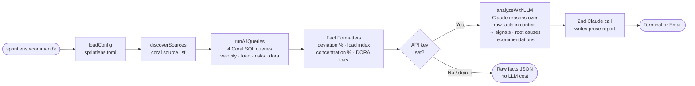
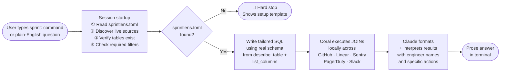

# SprintLens

> Engineering team health in one terminal command.
### Demo video : https://www.loom.com/share/6d4c8a66525c4d098dd44c6295425e6e
## The problem

Every Monday morning, your engineering manager opens five tabs.

GitHub — to see which PRs have been sitting for a week. Linear — to count who has too many active issues. Sentry — to find out if any of those stale PRs correlate with errors in production. PagerDuty — to check if anyone is drowning in on-call load. A spreadsheet — to try to join all of this together by hand.

Two hours later, they have a rough picture of the sprint. It's already out of date.

**SprintLens automates that entire process in under 60 seconds.**

It uses [Coral](https://withcoral.com) — a local cross-source SQL runtime — to JOIN data across all five tools simultaneously, then passes the structured findings to Claude to reason about root causes and produce a clear, actionable briefing. Everything runs on your machine. No backend, no dashboard, no login.

```
> sprintlens report

━━━━━━━━━━━━━━━━━━━━━━━━━━━━━━━━━━━━━━━━━━━
  SPRINT HEALTH — Backend · May 31 2026
  Sources: GitHub · Linear · Sentry · PagerDuty
━━━━━━━━━━━━━━━━━━━━━━━━━━━━━━━━━━━━━━━━━━━

VELOCITY
Average cycle time is 4.1 days. Alice is at 7.1 days — 73% above
team average. PR review time doubled to 19hrs this sprint,
consistent with a review queue bottleneck.

LOAD
Bob has 9 active issues, 4 open PRs, and 8 PagerDuty pages this
month — all four load signals elevated. Clear burnout risk.
Redistribute 2-3 issues before next sprint planning.

RISKS
• PR #483 "refactor payment service" — open 9 days, 4 correlated
  Sentry errors, 1 incident. Triage today.
• PR #491 "update auth middleware" — open 6 days, no reviewers.

━━━━━━━━━━━━━━━━━━━━━━━━━━━━━━━━━━━━━━━━━━━
Sources: GitHub · Linear · Sentry · PagerDuty
May 31, 2026
```

It ships two ways:

- **npm CLI** — a TypeScript pipeline that runs Coral queries, uses Claude to analyze findings in context, and generates manager reports via the Claude API
- **Claude Code skill** — interactive `sprint:` commands inside Claude Code for ad-hoc questions and schema discovery

The same briefing is also available inside Claude Code:

```
> sprint: full report
```

> **Try it without any setup** — `npm run demo` runs a full interactive demo with hardcoded sample data. No Coral CLI, no API key required.

See `examples/manager-report.md`, `examples/employee-dm.md`, and `examples/executive-report.md` for sample output formats.

---


## How it works

SprintLens has no backend, no dashboard, and no login. Everything runs locally on your machine.

### npm CLI



**Commands at a glance:**

| Command | LLM? | What you get |
|---|---|---|
| `sprintlens dryrun` | ✗ | Formatted raw facts JSON — debug your data |
| `sprintlens dora` | ✗ | DORA metrics with industry-standard tiers |
| `sprintlens report` | ✓ | Full manager briefing — velocity, load, risks |
| `sprintlens digest` | ✓ | Private per-engineer digest (supportive tone) |
| `sprintlens executive` | ✓ | Systems-level summary, no engineer names |

### Claude Code Skill



**Skill commands at a glance:**

| Command | What you get |
|---|---|
| `sprint: full report` | Weekly briefing — velocity, load, and risks |
| `sprint: velocity` | Cycle time and PR review time by engineer |
| `sprint: load` | Who has too much active work right now |
| `sprint: risks` | Open PRs most likely to cause incidents |
| `sprint: dora` | DORA metrics from your actual data |
| `sprint: why is [name] slow` | Focused single-engineer diagnosis |
| `sprint: who should review [PR]` | Best available reviewer by capacity |

> **Full step-by-step diagrams** — including every branch, what the user sees at each step, and error recovery paths — are in [`docs/user-flow.md`](docs/user-flow.md).

Your credentials never leave your machine.

---

## Project structure

```
src/
├── commands/     init, doctor, report, dryrun
├── config/       sprintlens.toml loading and validation
├── coral/        Coral CLI integration and SQL queries
├── analysis/     Fact formatters — no hardcoded thresholds
├── llm/          LLM analysis + Claude report generation
├── reports/      Manager, employee, and executive report objects
├── delivery/     Email delivery (Slack stub — future extension)
├── types/        Shared TypeScript interfaces
├── utils/        Logging, dates, formatting
└── demo.ts       Interactive demo — all features, no setup required

docs/
└── user-flow.md  Detailed user flow diagrams (CLI + Claude Code skill)

skills/SKILL.md   Claude Code skill definition
examples/         Sample report output
```

---

## Prerequisites

- [Node.js](https://nodejs.org/) 18 or later (for the CLI)
- [Coral CLI](https://withcoral.com/docs/getting-started/installation) installed
- [Claude Code](https://claude.ai/code) installed (for the skill and interactive `sprint:` commands)
- Accounts/tokens for the tools you want to connect
- An [Anthropic API key](https://console.anthropic.com/) (for `sprintlens report` — optional for `sprintlens dryrun`)

---

## Setup

### 1. Install Coral

**macOS**
```bash
brew install withcoral/tap/coral
```

**Windows (PowerShell as Administrator)**
```powershell
Invoke-WebRequest `
  -Uri "https://github.com/withcoral/coral/releases/latest/download/coral-x86_64-pc-windows-msvc.zip" `
  -OutFile "coral.zip"
Expand-Archive coral.zip -DestinationPath coral -Force
New-Item -ItemType Directory -Force -Path "$env:USERPROFILE\.local\bin"
Copy-Item coral\coral.exe "$env:USERPROFILE\.local\bin\coral.exe"
[Environment]::SetEnvironmentVariable("Path", "$env:USERPROFILE\.local\bin;$env:Path", "User")
```

**Linux**
```bash
curl -fsSL https://withcoral.com/install.sh | sh
```

Verify:
```bash
coral --version
```

### 2. Connect your sources

Minimum required (GitHub + Linear):
```bash
coral source add --interactive github
coral source add --interactive linear
```

Strongly recommended:
```bash
coral source add --interactive sentry
coral source add --interactive pagerduty
```

Optional:
```bash
coral source add --interactive slack
```

### 3. Register Coral with Claude Code

```bash
claude mcp add --scope user coral -- coral mcp-stdio
```

### 4. Install SprintLens

**Install globally from npm (recommended):**
```bash
npm install -g sprintlens
```

Then run from any directory containing `sprintlens.toml`:
```bash
sprintlens init
```

**Or from source:**
```bash
git clone https://github.com/HansujaB/sprintlens.git
cd sprintlens
npm install
npm run build
npm link   # makes sprintlens available globally
```

**Claude Code skill:**
```bash
# Copy skill definition to Claude Code's skills directory
cp node_modules/sprintlens/skills/SKILL.md ~/.claude/skills/sprintlens.md
```
Or if you cloned from source:
```bash
cp skills/SKILL.md ~/.claude/skills/sprintlens.md
```

### 5. Create your config file

Copy the example and fill in your team details:

```bash
cp sprintlens.toml.example sprintlens.toml
```

Or use the CLI:
```bash
npx sprintlens init
```

Edit `sprintlens.toml`:

```toml
[team]
name              = "Backend"
github_org        = "your-org"
github_repo       = "your-repo"
linear_team       = "Backend"
sentry_org        = "your-sentry-org"
pagerduty_service = "backend-api"
slack_channel     = "eng-backend"

[engineers]
alice = { github = "alice-dev", email = "alice@company.com", slack = "Alice" }
bob   = { github = "bobsmith",  email = "bob@company.com",   slack = "Bob S" }

# Required for --email commands (edit before use)
[delivery]
manager_email   = "eng-manager@company.com"
executive_email = "cto@company.com"

[delivery.smtp]
host   = "smtp.gmail.com"
port   = 587
secure = false
from   = "SprintLens <reports@company.com>"
```

Set SMTP credentials before emailing reports:
```bash
export SPRINTLENS_SMTP_USER=your-smtp-user
export SPRINTLENS_SMTP_PASS=your-smtp-password
```

### 6. Verify everything

```bash
coral source list
coral sql "SELECT schema_name, table_name FROM coral.tables ORDER BY 1, 2"
npx sprintlens doctor
```

---

## Usage

### CLI commands

Run from the directory containing your `sprintlens.toml`:

| Command | What you get |
|---|---|
| `npx sprintlens init` | Create `sprintlens.toml` from the example file |
| `npx sprintlens doctor` | Verify config, Coral CLI, and connected sources |
| `npx sprintlens report` | Full pipeline — Coral queries, analysis, Claude report |
| `npx sprintlens report --email` | Email manager report to `[delivery] manager_email` |
| `npx sprintlens digest --email` | Email each engineer their digest (uses `[engineers]` emails) |
| `npx sprintlens executive` | Executive engineering health summary (requires API key) |
| `npx sprintlens executive --email` | Email to `[delivery] executive_email` |
| `npx sprintlens dora` | Formatted DORA metrics — no LLM required |
| `npx sprintlens dora --email` | Email DORA report to executive or manager |
| `npx sprintlens dryrun` | Coral queries + formatted raw facts only (no LLM) |

For prose reports, set your Anthropic API key:
```bash
export ANTHROPIC_API_KEY=sk-ant-...
npx sprintlens report
```

For email delivery, edit `[delivery]` and `[delivery.smtp]` in `sprintlens.toml`, then:
```bash
export SPRINTLENS_SMTP_USER=...
export SPRINTLENS_SMTP_PASS=...
npx sprintlens report --email
npx sprintlens digest --email
npx sprintlens executive --email
npx sprintlens dora --email
```

Without an API key, `sprintlens report` exits with a warning. Use `sprintlens dryrun` to inspect raw Coral facts without any LLM call.

### Claude Code skill commands

Open Claude Code in the directory containing your `sprintlens.toml` and type:

| Command | What you get |
|---|---|
| `sprint: full report` | Weekly briefing — velocity, load, and risks combined |
| `sprint: velocity` | Cycle time and PR review time by engineer |
| `sprint: load` | Who has too much active work right now |
| `sprint: risks` | Open PRs most likely to cause incidents |
| `sprint: dora` | DORA metrics computed from your actual data |
| `sprint: why is [name] slow` | Focused analysis on one engineer |
| `sprint: who should review [PR]` | Best available reviewer by capacity |

You can also ask in plain English:
- "why is the backend team slower this sprint?"
- "who has the most open work right now?"
- "are any PRs about to cause incidents?"

---

## Sources and what they contribute

| Source | Required | What it adds |
|---|---|---|
| `github` | Yes | PRs, review time, deployment frequency |
| `linear` | Yes | Cycle time, active issues, team velocity |
| `sentry` | Recommended | Error rates, change failure rate signal |
| `pagerduty` | Recommended | On-call load, MTTR, incidents |
| `slack` | Optional | Discussion activity, PR mentions |

SprintLens works with only GitHub + Linear connected. Each additional source adds more signal to the diagnosis.

---

## Token requirements

| Source | Token needed | Where to get it |
|---|---|---|
| GitHub | Personal access token (`read:repo`, `read:org`) | github.com/settings/tokens |
| Linear | Personal API key (Read) | linear.app/settings/api |
| Sentry | Internal integration token | sentry.io → Settings → Auth Tokens |
| PagerDuty | Read-only General Access REST API key | pagerduty.com → API Access |
| Slack | Bot token with `channels:read`, `channels:history`, `users:read` | api.slack.com/apps |

---

## Privacy

- All queries execute locally via Coral
- No data is sent to any SprintLens server (there is no server)
- Credentials are stored locally by Coral in OS credential storage
- Claude Code processes results locally
- The CLI sends only structured findings (signals, root causes, recommendations) to the Anthropic API for report writing — never raw Coral rows
- The only network calls are from Coral to the tool APIs you connected, plus Anthropic when running `sprintlens report`

---

## DORA metric benchmarks

| Metric | Elite | High | Medium | Low |
|---|---|---|---|---|
| Deployment Frequency | Multiple/day | Daily | Weekly | Monthly |
| Lead Time | < 1 hour | < 1 day | < 1 week | > 1 week |
| Change Failure Rate | < 5% | < 10% | < 15% | > 15% |
| MTTR | < 1 hour | < 1 day | < 1 week | > 1 week |

Source: [DORA State of DevOps Report](https://dora.dev)

The CLI computes DORA metrics from Coral data across four modular SQL fragments in `src/coral/queries/dora-*.sql` and classifies tiers using the industry-standard benchmarks above — no LLM required. Fragments are assembled at runtime based on which sources are connected (PagerDuty-dependent metrics are excluded when PagerDuty is missing). The `sprint: dora` skill command provides the same metrics interactively inside Claude Code.

---

## FAQ

**What does Claude actually see?**

Run `sprintlens dryrun` to see exactly what gets passed to the LLM — structured JSON of pre-computed facts (cycle deviation %, load index, PR concentration %, DORA tiers). Claude never sees raw API responses or unaggregated rows. Every recommendation is traceable to a specific value in that JSON.

**Why Coral instead of calling the APIs directly?**

With direct provider MCPs, an agent makes one tool call per source, handles pagination and auth separately, and stitches results together in application code. Coral gives SprintLens one SQL interface for all sources simultaneously.

Coral benchmarked this on 82 real-world AI tasks vs direct provider MCPs with Claude:
- **20% more accurate** overall
- **2× more cost-efficient** overall
- **42% lower latency** overall
- **31% more accurate** on multi-hop cross-source tasks (exactly what SprintLens does)
- **3.4× more cost-efficient** on those same tasks

**Is this a dashboard?**

No. There is no backend, no database, no login, no server, and no hosted service. SprintLens is a local CLI that issues SQL queries through Coral, passes structured findings to the Anthropic API once, and prints the result to your terminal. You can also email the report, but the report is generated locally first. Your credentials never leave your machine — they're stored by Coral in OS credential storage.

**Does it write to any of my tools?**

No. Every Coral query is read-only `SELECT`. SprintLens cannot create, update, or delete anything in GitHub, Linear, Sentry, or PagerDuty.

**What if I only have GitHub and Linear?**

SprintLens works with just those two. Sentry adds error correlation to stale PRs, PagerDuty adds on-call load and DORA CFR/MTTR. Each additional source adds more signal to the diagnosis, but none are required.

---

## Built with

- [Coral](https://withcoral.com) — cross-source SQL runtime
- [Claude Code](https://claude.ai/code) — AI coding agent
- [Claude API](https://anthropic.com) — report writing from structured findings
- TypeScript + Node.js — CLI, fact formatters, and LLM-enriched analysis pipeline
- Coral Hackathon 2026
