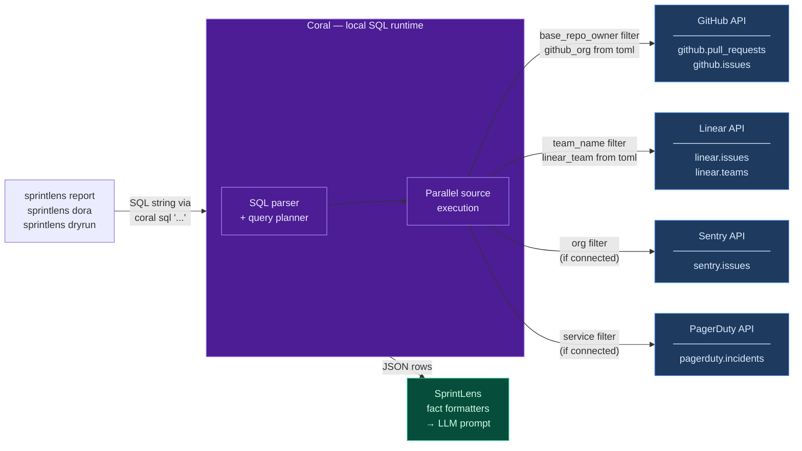
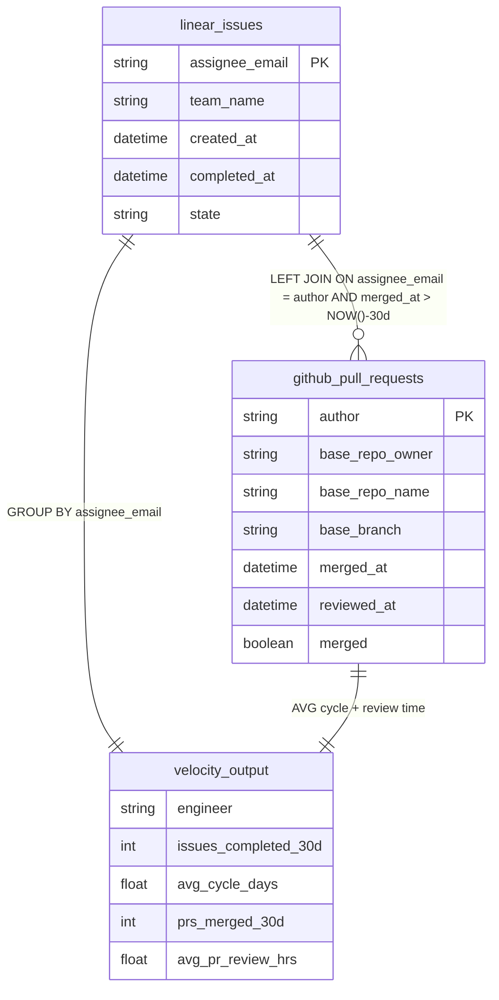
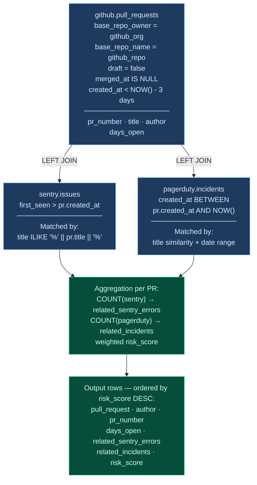
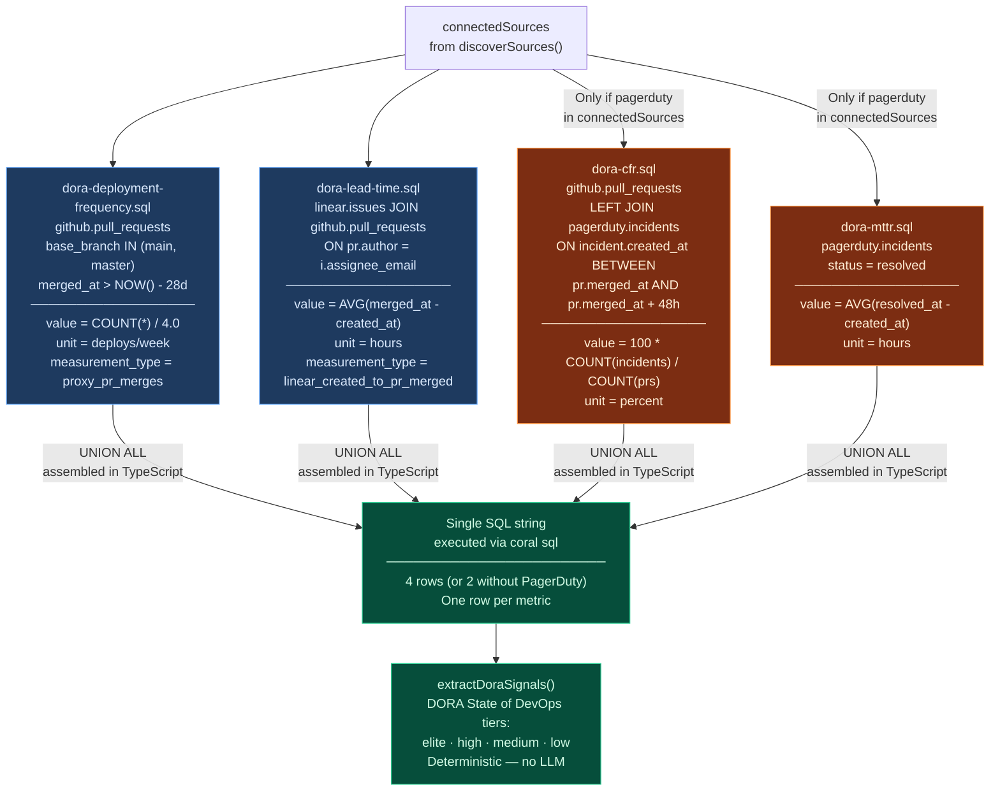
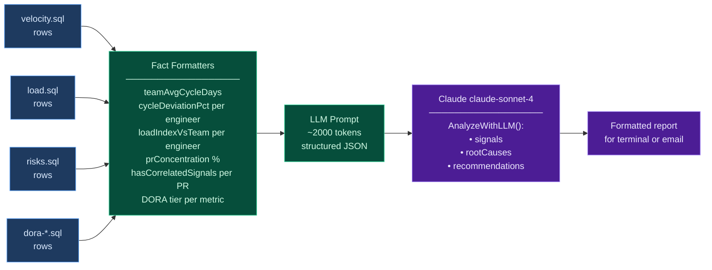

# SprintLens — How the SQL JOINs Work

SprintLens uses [Coral](https://withcoral.com) to issue cross-source SQL queries that JOIN live data from GitHub, Linear, Sentry, and PagerDuty in a single statement. This page explains every JOIN — source tables, conditions, and output columns — so you know exactly what data each report is built on.

---

## Why Coral makes this possible

Without Coral you'd need four separate API clients, each with its own auth, pagination, and retry logic. Then you'd stitch the results together in application code.

Coral gives SprintLens **one SQL interface** over all sources simultaneously:



> **Benchmark:** Claude with Coral was **20% more accurate, 2× more cost-efficient, and 42% lower latency** than using direct provider MCPs — because it issues one structured query instead of many tool calls. For multi-hop tasks like SprintLens's cross-source JOINs, accuracy jumped to **31% higher** with **3.4× better cost efficiency**.

---

## Query 1 — velocity.sql

Measures how fast each engineer moves work from creation to merge.

**Join:** `linear.issues` LEFT JOIN `github.pull_requests`  
**Bridge column:** `linear.issues.assignee_email = github.pull_requests.author`



**The LEFT JOIN matters:** engineers who completed Linear issues but had **zero** merged PRs in the window still appear — they're the most likely candidates for blockers or review delays. An INNER JOIN would silently drop them.

**Key filter applied:** `linear.issues.team_name = '{linear_team}'` — scoped to your team only.

---

## Query 2 — load.sql

Measures concurrent workload per engineer across all four sources.

**Joins:** `linear.issues` LEFT JOIN `github.pull_requests` LEFT JOIN `sentry.issues` LEFT JOIN `pagerduty.incidents`

```mermaid
flowchart LR
    E["Engineer email\nfrom config"]

    E -->|"assignee_email IN\n(alice, bob, ...)"| LI

    LI["linear.issues\nstate = in_progress\n── active_linear_issues"]

    LI -->|"LEFT JOIN\nopen_prs\nassignee_email = author"| PR

    PR["github.pull_requests\nstate = open\n── open_prs"]

    PR -->|"LEFT JOIN\nassignee_email = assigned_to\nsentry (if connected)"| SE

    SE["sentry.issues\nstatus = unresolved\n── unresolved_sentry_errors"]

    SE -->|"LEFT JOIN\nassignee_email = resolved_by\npagerduty (if connected)"| PD

    PD["pagerduty.incidents\nstatus = triggered\ncreated_at > NOW()-30d\n── pagerduty_incidents_30d"]

    PD --> OUT

    OUT["Output per engineer:\nengineer\nactive_linear_issues\nopen_prs\nunresolved_sentry_errors\npagerduty_incidents_30d\nload_score (weighted)"]

    classDef src fill:#1e3a5f,stroke:#60a5fa,color:#dbeafe
    classDef out fill:#064e3b,stroke:#34d399,color:#d1fae5
    class LI,PR,SE,PD src
    class OUT out
```



**load_score** is a pre-computed weighted signal: `(active_issues × 2) + (open_prs × 1) + (sentry × 1) + (pagerduty × 3)`. It's passed to the LLM alongside the raw counts so Claude can validate its severity ranking against a pre-ranked value.

**Sentry and PagerDuty are optional.** Both joins are `LEFT JOIN` — if those sources are missing, their columns return `NULL`, which `rowToLoad()` coerces to `0`.

---

## Query 3 — risks.sql

Finds stale PRs and cross-correlates them with production signals.

**Join:** `github.pull_requests` LEFT JOIN `sentry.issues` LEFT JOIN `pagerduty.incidents`  
**Bridge:** title similarity + overlapping date ranges



**risk_score** = `(days_open × 2) + (sentry_errors × 3) + (incidents × 5)`. The SQL pre-ranks PRs by risk before the results reach the LLM — Claude uses this as a signal for what to flag first.

**No false positives:** Sentry and PagerDuty matches require both title similarity AND a date window that starts after the PR was created — preventing spurious correlations from pre-existing errors.

---

## Query 4 — DORA (4 conditional fragments)

DORA is assembled dynamically from **4 separate SQL fragments** — PagerDuty-dependent metrics are only included when PagerDuty is connected.



**Why fragments?** The old monolithic `dora.sql` unconditionally queried `pagerduty.incidents` — meaning `sprintlens dora` always crashed if PagerDuty wasn't connected. Now `runDoraQuery()` assembles the UNION at runtime based on `sourceStatus.connected`.

---

## Identity bridging

The hardest part of cross-source JOINs is that the same person has different identifiers in each tool:

| Source | Identifier |
|--------|-----------|
| GitHub | `author` (login handle) |
| Linear | `assignee_email` |
| Sentry | `assigned_to` (email) |
| PagerDuty | `resolved_by` (email) |

SprintLens resolves this through `sprintlens.toml`:

```toml
[engineers.alice]
github = "alice-codes"      # GitHub login
email  = "alice@company.com" # canonical bridge key
slack  = "U012AB3CD"         # optional
```

The `getEngineerEmails()` function extracts the email list, which becomes the `{engineer_emails}` substitution in every SQL query (`WHERE assignee_email IN (...)`). Email is the canonical bridge key across all four sources.

---

## What the LLM actually sees

After all queries run, `formatVelocityFacts`, `formatWorkloadFacts`, `formatBottleneckFacts`, and `formatRiskFacts` compute relative metrics (deviation %, load index, concentration %) and pass a structured JSON prompt to Claude. Claude never writes SQL or sees raw API responses — it reasons over pre-aggregated, normalized facts.


