# SprintLens — User Flow Diagrams

Detailed step-by-step flow for both ways to use SprintLens.

- [npm CLI Tool](#1-npm-cli-tool)
- [Claude Code Skill](#2-claude-code-skill)

---

## 1. npm CLI Tool

Every command, every decision branch, and exactly what the user sees at each step.

```mermaid
flowchart TD
    START([👤 User opens terminal]) --> INSTALL

    INSTALL["<b>One-time setup</b>\n① Install Coral CLI\n② coral source add --interactive github\n③ coral source add --interactive linear\n④ optional: sentry · pagerduty · slack\n⑤ git clone + npm install + npm run build\n⑥ npm link  →  sprintlens available globally"] --> CONFIG

    CONFIG{"sprintlens.toml\nexists?"}
    CONFIG -- No --> INIT
    CONFIG -- Yes --> HASKEY

    INIT["<b>sprintlens init</b>\n📄 Copies sprintlens.toml.example\n   to sprintlens.toml\nUser sees:\n  ✔ sprintlens.toml created\n  Edit team · engineers · delivery\n  sections then re-run"]
    INIT --> EDITTOML

    EDITTOML["User edits sprintlens.toml:\n• team.name · github_org · github_repo\n• linear_team · sentry_org\n• pagerduty_service · slack_channel\n• engineers identity mapping\n• delivery SMTP + email addresses"]
    EDITTOML --> DOCTOR

    HASKEY --> DOCTOR

    DOCTOR["<b>sprintlens doctor</b>\n① Loads + validates sprintlens.toml\n② coral source list — checks connected\n③ Queries coral.tables for each source\nUser sees:\n  ✔ sprintlens.toml valid\n  ✔ Coral CLI installed v1.x\n  ✔ github · linear connected\n  ⚠ sentry not connected\n  → coral source add --interactive sentry"]

    DOCTOR --> COMMAND

    COMMAND{{"Which command?"}}

    COMMAND --> DRYRUN
    COMMAND --> REPORT
    COMMAND --> DIGEST
    COMMAND --> EXECUTIVE
    COMMAND --> DORA

    DRYRUN["<b>sprintlens dryrun</b>\nNo API key needed"]
    DRYRUN --> DRY1["① loadConfig — reads sprintlens.toml"]
    DRY1 --> DRY2["② discoverSources\n   coral source list\n   records connected vs missing"]
    DRY2 --> DRY3["③ runAllQueries — 4 Coral SQL queries\n   velocity.sql · load.sql · risks.sql\n   dora-deployment-frequency.sql\n   dora-lead-time.sql\n   + dora-cfr.sql + dora-mttr.sql\n   only if PagerDuty connected"]
    DRY3 --> DRY4["④ formatVelocityFacts\n   team avg cycle days\n   per-engineer deviation %"]
    DRY4 --> DRY5["⑤ formatWorkloadFacts\n   normalized load index vs team avg\n   per-engineer issues · PRs · incidents"]
    DRY5 --> DRY6["⑥ formatBottleneckFacts\n   total open PRs\n   concentration % per engineer"]
    DRY6 --> DRY7["⑦ formatRiskFacts\n   stale PR count\n   days open · Sentry errors · incidents per PR"]
    DRY7 --> DRY8["⑧ extractDoraSignals\n   DORA tier math — industry benchmarks\n   elite / high / medium / low per metric"]
    DRY8 --> DRY_OUT["📋 Terminal — structured JSON:\n{\n  team: 'Backend',\n  sources: { connected: ['github','linear'],\n             missing: ['sentry'] },\n  facts: { velocity: { teamAvgCycleDays: 4.2,\n             engineers: [{engineer: 'alice',\n               cycleDeviationPct: 69}] },\n    workload: { teamSize: 5, engineers: [...] },\n    bottlenecks: { totalOpenPrs: 12,\n      prConcentration: [...] },\n    risks: { stalePrCount: 4, prs: [...] },\n    dora: [{metric:'lead_time',tier:'medium'}]\n  }\n}\nNo LLM call — No API key consumed"]

    REPORT["<b>sprintlens report</b>\nRequires ANTHROPIC_API_KEY"]
    REPORT --> RPT_KEY{"ANTHROPIC_API_KEY\nset?"}
    RPT_KEY -- No --> RPT_NOKEY["⚠ No API key found\nUser sees:\n  No ANTHROPIC_API_KEY —\n  use sprintlens dryrun for raw facts\n  or set: export ANTHROPIC_API_KEY=sk-ant-…"]
    RPT_KEY -- Yes --> RPT1

    RPT1["① loadConfig + discoverSources\n② runAllQueries — 4 Coral SQL queries"]
    RPT1 --> RPT2["③ Build ReportMetadata\n   teamName · generatedAt\n   periodDays 30 · sourcesQueried"]
    RPT2 --> RPT3["④ analyzeWithLLM\n   buildAnalysisPrompt:\n   formats all fact objects with\n   team size + relative numbers + context\n   sends to claude-sonnet-4"]
    RPT3 --> RPT4["⑤ Anthropic API call 1 — ANALYSIS\n   Model receives:\n   velocity facts · workload facts\n   bottleneck facts · risk facts\n   DORA signals\n   → Returns AnalysisResult JSON\n     signals · rootCauses · recommendations"]
    RPT4 --> RPT5["⑥ generateManagerReport\n   buildManagerPrompt:\n   signals JSON · rootCauses JSON\n   recommendations JSON\n   → second callClaude()"]
    RPT5 --> RPT6["⑦ Anthropic API call 2 — PROSE\n   Model receives structured findings\n   → Returns prose report:\n   summary · VELOCITY · LOAD\n   ROOT CAUSES · RECOMMENDED ACTIONS\n   RISKS  (30 lines max)"]
    RPT6 --> RPT7["⑧ formatManagerReport\n   styled terminal output"]
    RPT7 --> RPT_EMAIL{"--email flag?"}
    RPT_EMAIL -- No --> RPT_TERM["📋 Terminal:\n━━━━━━━━━━━━━━━━━━━━━━━━━━━\n  SPRINT HEALTH — Backend · May 31\n  Sources: GitHub · Linear · Sentry\n━━━━━━━━━━━━━━━━━━━━━━━━━━━\nVELOCITY\n  Avg cycle 4.2d. Alice at 7.1d — 69% above avg\nLOAD\n  Bob: 9 issues, 4 PRs, 8 PD pages\nROOT CAUSES\n  • Review bottleneck (high confidence)\nRECOMMENDATIONS\n  • Redistribute review load from Alice\nRISKS\n  • PR #483 — 9 days, 4 Sentry errors"]
    RPT_EMAIL -- Yes --> RPT_SMTP["📧 sendConfiguredEmail\n  SMTP → manager_email\n  Subject: Sprint Health — Backend · May 31\n  ✔ Emailed to eng-manager@company.com"]

    DIGEST["<b>sprintlens digest</b>\nRequires ANTHROPIC_API_KEY"]
    DIGEST --> DIG1["① runPipeline — same Coral + analyzeWithLLM\n② listEngineers from sprintlens.toml"]
    DIG1 --> DIG2{"--engineer flag?"}
    DIG2 -- Yes --> DIG3["Filter to that one engineer only"]
    DIG2 -- No --> DIG4["Loop over ALL configured engineers"]
    DIG3 & DIG4 --> DIG5["For each engineer:\n③ generateEmployeeDigest\n   buildEmployeePrompt:\n   • this engineer's signals only\n   • their relevant root causes\n   Tone: supportive — not evaluative\n   → callClaude max 1024 tokens"]
    DIG5 --> DIG6["④ Anthropic API call per engineer\n   Returns:\n   greeting · WORKLOAD bullets\n   BLOCKERS bullets · SUGGESTED ACTIONS"]
    DIG6 --> DIG_EMAIL{"--email flag?"}
    DIG_EMAIL -- No --> DIG_TERM["📋 Terminal per engineer:\nHey Alice 👋\nWORKLOAD\n  • 7 active issues — above your avg\nBLOCKERS\n  • PR #491 waiting on reviewer 6 days\nSUGGESTED ACTIONS\n  • Close or reassign PR #491 today"]
    DIG_EMAIL -- Yes --> DIG_SMTP["📧 Per engineer to their email\n   Subject: Your SprintLens digest — Backend"]

    EXECUTIVE["<b>sprintlens executive</b>\nRequires ANTHROPIC_API_KEY"]
    EXECUTIVE --> EXE1["① runPipeline — same Coral + analyzeWithLLM\n② Delivery confidence from LLM analysis\n   Claude returns high/medium/low\n   based on cross-signal reasoning\n   No hardcoded thresholds"]
    EXE1 --> EXE2["③ generateExecutiveReport\n   buildExecutivePrompt:\n   • root causes only — no engineer names\n   • DORA signals · delivery confidence\n   • Focus: systems patterns not people\n   → callClaude max 20 lines"]
    EXE2 --> EXE3["④ Anthropic API call — EXECUTIVE\n   Returns:\n   2-sentence summary\n   velocity trend · engineering risk\n   top 2 recommended actions"]
    EXE3 --> EXE_EMAIL{"--email flag?"}
    EXE_EMAIL -- No --> EXE_TERM["📋 Terminal:\nEngineering trending slower this sprint.\nDelivery Confidence: MEDIUM\nVelocity Trend: Lead time up 2x…\nRisk: 2 stale PRs with Sentry errors\nActions:\n  1. Toil reduction review for on-call team\n  2. Triage stale PRs in today's standup"]
    EXE_EMAIL -- Yes --> EXE_SMTP["📧 sendConfiguredEmail\n  To: executive_email or manager_email\n  Subject: Engineering Health — Backend"]

    DORA["<b>sprintlens dora</b>\nNo API key needed"]
    DORA --> DORA1["① loadConfig + discoverSources\n② runDoraQuery(config, connectedSources)\n   Builds UNION from dora-*.sql fragments\n   PagerDuty blocks only if PD connected\n③ extractDoraSignals\n   industry-standard DORA tier math\n④ formatDoraReport — no LLM"]
    DORA1 --> DORA_EMAIL{"--email flag?"}
    DORA_EMAIL -- No --> DORA_TERM["📋 Terminal:\nDORA METRICS — Backend · Last 30 days\n\nDeployment Frequency  3.2/week  Medium\nLead Time             18 hrs    High\nChange Failure Rate   8%        High  *\nMTTR                  4 hrs     High  *\n\n* Requires PagerDuty to compute\n  coral source add --interactive pagerduty"]
    DORA_EMAIL -- Yes --> DORA_SMTP["📧 Email to executive_email or manager_email"]

    classDef cmd fill:#1e293b,stroke:#38bdf8,color:#e2e8f0
    classDef out fill:#064e3b,stroke:#34d399,color:#d1fae5
    classDef api fill:#4c1d95,stroke:#a78bfa,color:#ede9fe
    classDef warn fill:#7c2d12,stroke:#fb923c,color:#ffedd5
    classDef step fill:#1e3a5f,stroke:#60a5fa,color:#dbeafe
    classDef gate fill:#1f2937,stroke:#fbbf24,color:#fef3c7

    class DRYRUN,REPORT,DIGEST,EXECUTIVE,DORA cmd
    class DRY_OUT,RPT_TERM,RPT_SMTP,DIG_TERM,DIG_SMTP,EXE_TERM,EXE_SMTP,DORA_TERM,DORA_SMTP out
    class RPT4,RPT6,DIG6,EXE3 api
    class RPT_NOKEY warn
    class DRY1,DRY2,DRY3,DRY4,DRY5,DRY6,DRY7,DRY8,RPT1,RPT2,RPT3,RPT5,RPT7 step
    class RPT_KEY,COMMAND,RPT_EMAIL,DIG_EMAIL,EXE_EMAIL,DORA_EMAIL,DIG2 gate
```

---

## 2. Claude Code Skill

Session startup, every `sprint:` command, error recovery, and plain-English fallback.

```mermaid
flowchart TD
    START([👤 User opens Claude Code\nin project directory]) --> PREREQ

    PREREQ["One-time prerequisites\n① Coral CLI installed\n② coral source add github + linear\n③ claude mcp add --scope user coral -- coral mcp-stdio\n④ npx skills add sprintlens"]

    PREREQ --> S1

    subgraph SESSION["Automatic Session Startup — runs before every command"]
        S1["Step 1 — Read Identity Config\nLooks for sprintlens.toml in cwd\nReads team + engineers sections:\n  github_org · github_repo · linear_team\n  per-engineer: github login → email → slack"]
        S1 --> S1_CHECK{"sprintlens.toml\nfound?"}
        S1_CHECK -- No --> S1_STOP["🛑 Hard stop\nUser sees full template message:\n  SprintLens needs a sprintlens.toml\n  to map engineer identities across tools\n  [shows exact TOML structure]\n  Do not proceed until file exists."]
        S1_CHECK -- Yes --> S2

        S2["Step 2 — Discover Connected Sources\nMCP sql tool:\n  SELECT DISTINCT schema_name\n  FROM coral.tables ORDER BY 1\nBuilds list:\n  github ✔ · linear ✔\n  sentry ✗ · pagerduty ✗ · slack ✗"]
        S2 --> S3["Step 3 — Verify Key Tables\n  SELECT schema_name, table_name\n  FROM coral.tables\n  WHERE schema_name IN\n  ('github','linear','sentry',…)"]
        S3 --> S4["Step 4 — Check Required Filters\n  describe_table — github.pull_requests\n  describe_table — linear.issues\n  Learns: which columns require\n  filter values before returning data\n  Gets filter values from sprintlens.toml"]
        S4 --> READY["✅ Session ready\nClaude holds in context:\n• live source list\n• actual table + column schemas\n• required filter names and values\n• full engineer identity map\nShows brief session summary to user"]
    end

    READY --> CMD{{"User types command\nor plain-English question"}}

    CMD --> VEL["sprint: velocity\nOR 'cycle time' · 'where are we slow'\n'lead time' · 'PR review time'"]
    CMD --> LDC["sprint: load\nOR 'who is overloaded' · 'burnout risk'\n'who has too much work'"]
    CMD --> RSK["sprint: risks\nOR 'what is at risk' · 'stale PRs'\n'what needs triage today'"]
    CMD --> FRP["sprint: full report\n— primary weekly briefing command"]
    CMD --> DRA["sprint: dora\nOR 'DORA metrics' · 'deployment freq'\n'change failure rate' · 'MTTR'"]
    CMD --> WHY["sprint: why is NAME slow"]
    CMD --> WHO["sprint: who should review PR"]
    CMD --> ENG["Plain-English question\n'why is backend slower this sprint?'\n'who has the most open work?'\n'are any PRs about to cause incidents?'"]

    VEL --> V1["① list_columns — linear.issues\n   list_columns — github.pull_requests\n   Never guesses column names"]
    V1 --> V2["② Cross-source velocity SQL:\n   JOINs linear.issues + github.pull_requests\n   ON assignee_email = pr.author\n   Filter: team_name = linear_team from toml\n           merged_at > NOW() - 30 days\n   Computes: avg_cycle_days · avg_review_hrs\n   per engineer"]
    V2 --> V3{"PagerDuty\nconnected?"}
    V3 -- Yes --> V4["③ Secondary query:\n   Do slow engineers also have high on-call?\n   Surfaces cross-signal correlation"]
    V3 -- No --> V5
    V4 --> V5["④ Normalize identities via engineers map\n   github login → display name\n⑤ Flag anyone > 50% above team avg\n   Note PRs open > 5 days\n   Compute DORA Lead Time tier"]
    V5 --> VOUT["📋 User sees:\nVELOCITY — Backend · Last 30 days\nAverage cycle time is 4.2 days.\nAlice is at 7.1 days (69% above avg).\nPR review time 19 hrs — up from 8 hrs,\nsuggesting a review bottleneck.\nLead Time for Changes: 18 hrs (High tier)"]

    LDC --> L1["① Discovers columns for all connected sources\n② Cross-source load SQL:\n   linear.issues (state = in_progress)\n   LEFT JOIN github.pull_requests (open)\n   LEFT JOIN sentry.issues (unresolved)\n   LEFT JOIN pagerduty.incidents (30d)\n   GROUP BY engineer + weighted load_score\n③ Normalize identities via engineers map\n④ Raw counts + load_score passed to Claude\n   Claude determines severity —\n   no hardcoded thresholds in SprintLens"]
    L1 --> LOUT["📋 User sees:\nLOAD — Backend · Last 30 days\nBob: 9 active issues · 4 open PRs ·\n8 PagerDuty pages — significantly above avg.\nConsider redistributing 2-3 issues\nbefore next sprint planning.\nAlice: 6 issues · 2 PRs — borderline.\nMonitor next sprint."]

    RSK --> R1["① Query open non-draft PRs > 3 days old\n   Filter: base_repo_owner + base_repo_name\n   from sprintlens.toml"]
    R1 --> R2["② LEFT JOIN sentry.issues\n   ON title ILIKE '%' || pr.title || '%'\n   AND first_seen > pr.created_at\n③ LEFT JOIN pagerduty.incidents\n   ON title similarity + date range"]
    R2 --> R3{"Slack\nconnected?"}
    R3 -- Yes --> R4["④ Check slack.messages\n   for PR discussion activity\n   Is anyone actively talking about it?"]
    R3 -- No --> R5
    R4 --> R5["⑤ Rank by days_open + correlated signals\n⑥ Interpret:\n   PR + Sentry errors → triage today\n   PR + no reviewers → assign now\n   Old PR + no signals → lower priority"]
    R5 --> ROUT["📋 User sees:\nRISKS — Backend\n• PR #483 'refactor payment service'\n  Open 9 days · 4 Sentry errors.\n  Triage today before it escalates.\n• PR #491 'update auth middleware'\n  Open 6 days · no reviewers.\n  Alice is likely owner — check availability."]

    FRP --> F1["Runs velocity → load → risks in sequence\n3 Coral query sets total\nCombines all findings into\nweekly briefing format (max 30 lines)"]
    F1 --> FOUT["📋 User sees:\n━━━━━━━━━━━━━━━━━━━━━━━━━━━━━━━\n  SPRINT HEALTH — Backend · May 31 2026\n  Sources: GitHub · Linear · Sentry\n━━━━━━━━━━━━━━━━━━━━━━━━━━━━━━━\nVELOCITY\n  Avg cycle 4.2d. Alice at 7.1d — 69% above avg.\n  PR review 19hrs — up from 8hrs last sprint.\nLOAD\n  Bob: 9 issues · 4 PRs · 8 pages — redistribute.\nRISKS\n  • PR #483 — 9 days · 4 Sentry errors\n  • PR #491 — 6 days · no reviewer\n━━━━━━━━━━━━━━━━━━━━━━━━━━━━━━━\nMissing: PagerDuty — coral source add pagerduty"]

    DRA --> D1["Deployment Frequency:\n  PRs merged to main/master per week\n  Labeled as proxy (not actual deploys)"]
    D1 --> D2["Lead Time:\n  linear.issues.created_at →\n  github.pull_requests.merged_at\n  Requires identity map JOIN\n  elite < 1h · high < 1d · medium < 1w"]
    D2 --> D3{"PagerDuty\nconnected?"}
    D3 -- Yes --> D4["Change Failure Rate:\n  PRs merged → PD incidents within 48h\nMTTR:\n  PD incident created_at → resolved_at"]
    D3 -- No --> D5["CFR + MTTR: marked unavailable\nShows: coral source add --interactive pagerduty"]
    D4 & D5 --> D6["Classifies with DORA State of DevOps tiers:\nelite / high / medium / low per metric"]
    D6 --> DOUT["📋 User sees:\nDORA METRICS — Backend · Last 30 days\n\nDeployment Frequency  3.2/week  Medium\nLead Time             18 hrs    High\nChange Failure Rate   8%        High   *\nMTTR                  4 hrs     High   *\n\n* Computed from: GitHub · Linear · PagerDuty"]

    WHY --> W1["① Look up engineer's github login\n   from engineers in sprintlens.toml\n② Focused velocity query filtered\n   to that engineer only:\n   • Cycle time vs team average\n   • Blocked vs in-progress issues\n   • PR review wait time\n   • On-call load (if PD connected)\n   • Concurrent issue count"]
    W1 --> WOUT["📋 User sees:\nAlice: 7.1 days cycle time\n(69% above team average of 4.2 days).\n\nDiagnosis: 4 concurrent in-progress issues.\nContext switching is the likely cause\n— not skill or complexity.\n\n3 of her issues are blocked waiting on\nexternal dependencies.\n\nRecommend: cap to 2 issues,\nclear blockers first, then re-evaluate."]

    WHO --> WH1["① Load query for ALL engineers\n   → finds who has most capacity\n   fewest active issues + open PRs"]
    WH1 --> WH2["② Historical review query:\n   Has this engineer reviewed PRs\n   in the same service/directory?"]
    WH2 --> WH3{"PagerDuty\nconnected?"}
    WH3 -- Yes --> WH4["③ Exclude engineers currently on-call"]
    WH3 -- No --> WH5
    WH4 & WH5 --> WHOUT["📋 User sees:\nRecommend Bob for this review.\nCapacity: 3 active issues · 1 open PR\n(lowest on team right now).\nContext: reviewed 3 payment-service\nPRs in the last 2 months.\nNot on-call this week."]

    ENG --> E1["Claude maps question to closest\nsprint: command or writes\na custom Coral SQL query"]
    E1 --> E2["Schema discovery:\n  list_catalog / coral.tables\n  → describe_table → list_columns\n  → sql execution"]
    E2 --> EOUT["📋 Formatted prose answer\nwith specific names · numbers\nand actionable next steps"]

    VEL & LDC & RSK & FRP -.->|"Empty results"| ER1
    VEL & LDC & RSK & FRP -.->|"JOIN no rows"| ER2
    VEL & LDC & RSK & FRP -.->|"Source not found"| ER3
    VEL & LDC & RSK & FRP -.->|"Required filter error"| ER4

    ER1["⚠ Empty results\nWiden to 90 days\nSELECT DISTINCT team_name\nFROM linear.issues LIMIT 20\nCheck filter matches exactly"]
    ER2["⚠ JOIN produces no rows\nIdentity mapping is wrong\nTest each source independently\nCheck identifier format per source"]
    ER3["⚠ Source not found\ncoral source add --interactive NAME\nContinues with remaining sources"]
    ER4["⚠ Required filter missing\ndescribe_table to find filter\nGet value from sprintlens.toml\nAsk user if not present in toml"]

    ER1 & ER2 & ER3 & ER4 -.->|"Retried"| CMD

    classDef cmd fill:#1e293b,stroke:#38bdf8,color:#e2e8f0
    classDef out fill:#064e3b,stroke:#34d399,color:#d1fae5
    classDef step fill:#1e3a5f,stroke:#60a5fa,color:#dbeafe
    classDef err fill:#7c2d12,stroke:#fb923c,color:#ffedd5
    classDef gate fill:#1f2937,stroke:#fbbf24,color:#fef3c7
    classDef session fill:#172554,stroke:#818cf8,color:#e0e7ff

    class VEL,LDC,RSK,FRP,DRA,WHY,WHO,ENG cmd
    class VOUT,LOUT,ROUT,FOUT,DOUT,WOUT,WHOUT,EOUT out
    class V1,V2,V4,V5,L1,R1,R2,R4,R5,D1,D2,D4,D6,W1,WH1,WH2,WH4,E1,E2 step
    class ER1,ER2,ER3,ER4 err
    class CMD,V3,R3,D3,WH3 gate
    class S1,S2,S3,S4,READY session
```

